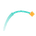

# AR Motion to Curve

A Maya tool that records the world-space motion of selected controls into a
curve, rigs a locator to travel along it (position + baked rotation), and
can re-attach the original controls to that locator - useful for path-based
edits, retiming, or cleaning up motion on an existing animation.



## What it does

- **Create Motion Curve** - samples each selected control's world position
  over a frame range and fits an EP (Edit Point) curve through it, so the
  curve interpolates exactly through the recorded motion. Rigs a `Mstr_Loc`
  / `Sub_LocOffset_Grp` / `Sub_Loc` chain that travels along the curve:
  - `Mstr_Loc` follows the curve (position + tangent orientation).
  - `Sub_LocOffset_Grp` tracks `Mstr_Loc`'s position; whether it also
    inherits Y rotation is controlled by **Follow Path Angle**.
  - `Sub_Loc` carries `U_Value` (position along the curve) and baked
    rotation matching the original control.
- **Follow Path Angle (On/Off)** - Off (default) keeps the rig fully
  decoupled from the curve's tangent orientation, so reshaping the curve,
  moving CVs, or scrubbing `U_Value` afterward never pops the baked
  rotation. On lets the rig yaw to face the travel direction while staying
  level.
- **Frame range options** - use the timeline's playback range, a custom
  range, or each control's own keyframe range (controls keyed over
  different spans are handled correctly, each on its own range).
- **Locator Scale slider** - resizes every locator this tool created
  (identified by the `M2C_` name prefix), anywhere in the scene, without
  touching unrelated locators.
- **Attach Controls** - point- and orient-constrains the original controls
  back onto their `Sub_Loc`, respecting whichever translate/rotate channels
  each control actually has free. Rotation constraint is optional (checkbox)
  for rigs where it fights the control's own setup.

Sampling and rotation baking are both batched across every control that
shares a frame range, rather than scrubbing the timeline once per control -
this matters once you're running the tool on more than a couple of controls
at a time.

## Requirements

- Maya 2022+ (PySide2/shiboken2; falls back to PySide6/shiboken6 on newer
  Maya versions that ship those instead)

## Installation

**Drag and drop (recommended):** drag `install_ar_motion_to_curve.py`
directly onto the Maya viewport (not into the Script Editor - the 3D
viewport itself). It writes `ar_motion_to_curve_ui.py` and the icon into
your Maya scripts folder and adds a shelf button automatically. Safe to
drag again later (e.g. after grabbing an updated version) - it overwrites
the old copy and replaces the shelf button instead of duplicating it.

**Manual install:** copy `scripts/ar_motion_to_curve_ui.py` into your Maya
scripts folder:
- Windows: `Documents\maya\scripts\`
- macOS: `~/Library/Preferences/Autodesk/maya/scripts/`
- Linux: `~/maya/scripts/`

(Maya adds this folder to `sys.path` automatically, so a plain `import`
works once it's there - no extra path setup needed.)

Then run it from the Script Editor (Python tab), or put this in a shelf
button:

```python
import importlib
import ar_motion_to_curve_ui
importlib.reload(ar_motion_to_curve_ui)
ar_motion_to_curve_ui.show_ui()
```

The `importlib.reload` line just makes sure Maya picks up any edits to
the script without needing a restart - drop it once you're not actively
changing the file.

## Usage

1. Select your controls, click **Load Selected**. (Create/Attach stay
   disabled until at least one control is loaded.)
2. Choose a **Frame Range** mode, and set **Divisions** / **Increment** /
   **Locator Scale** / **Follow Path Angle** as needed.
3. Click **Create Motion Curve**.
4. To drive the original controls from the resulting locators, toggle
   **Include Rotation Constraint** as needed and click **Attach Controls**.

## License

MIT - see [LICENSE](LICENSE).
